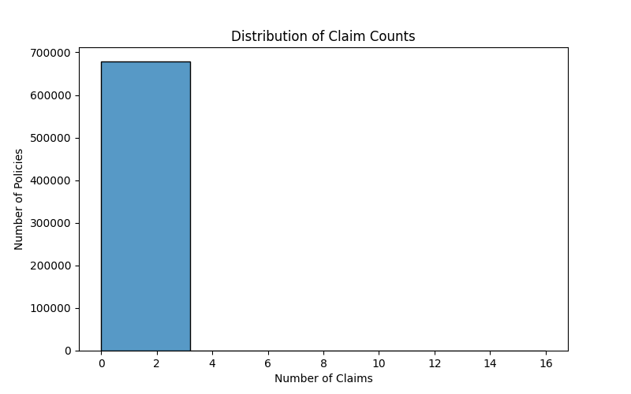
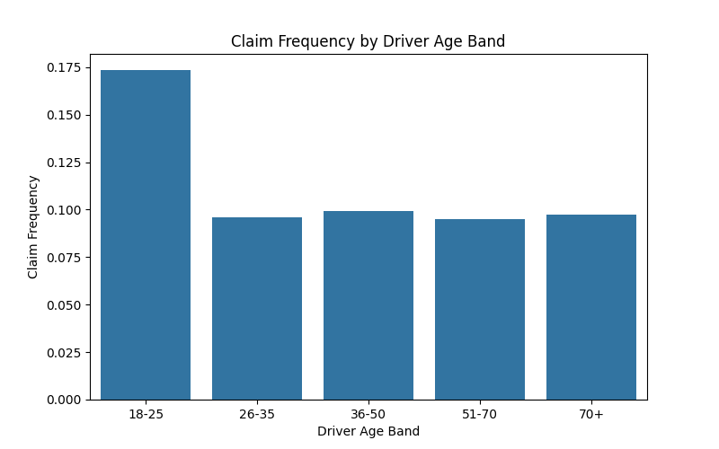
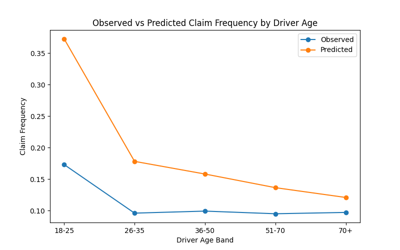

# Event Frequency Modelling using GLMs (Insurance Case Study)

A statistical modelling project focused on predicting event frequency (count data) using exposure-adjusted Generalized Linear Models (GLMs). The project demonstrates handling of overdispersion and model selection using Poisson and Negative Binomial approaches on a real-world insurance dataset.

---

## Executive Summary

* Built an exposure-adjusted claim frequency model using GLMs on the freMTPL2 dataset
* Identified overdispersion in claim counts (dispersion ≈ 2.77), violating Poisson assumptions
* Improved model performance using a Negative Binomial model
* Compared models using AIC and RMSE, showing better fit under overdispersion
* Evaluated predictive performance using train-test validation and calibration
* Identified key risk drivers: Bonus-Malus, Driver Age, Vehicle Age, and Population Density

This project demonstrates how count-based modelling techniques can be applied to real-world risk and event prediction problems.

---

## Key Results

* Dispersion Statistic: 2.77 (strong overdispersion)
* Poisson AIC: 288817
* Negative Binomial AIC: 287907
* RMSE (validation): ~0.55
* Negative Binomial model selected due to better fit
* Bonus-Malus identified as the strongest predictor
* Model predictions align well with observed values across segments

---

## Problem Statement

Many real-world problems involve predicting how often an event occurs rather than whether it occurs. This project models claim frequency using count-based statistical methods, accounting for varying exposure and addressing overdispersion in the data.

---

## Methodology

**Exploratory Analysis**

* Claim count distribution and sparsity
* Identification of skewness and zero-inflation characteristics

**Risk Segmentation**

* Driver Age
* Vehicle Age
* Bonus-Malus
* Vehicle Power
* Population Density

**Modelling Approach**

* Poisson Regression (baseline model)
* Overdispersion testing
* Negative Binomial Regression (final model)

---

## Model Comparison

| Model             | AIC    |
| ----------------- | ------ |
| Poisson           | 288817 |
| Negative Binomial | 287907 |

The Negative Binomial model provides a better fit as it accounts for overdispersion (variance exceeding the mean), which violates the Poisson assumption.

---

## Model Validation

* Train-test split used for out-of-sample evaluation
* RMSE used as performance metric
* Calibration analysis performed across risk segments

Predicted frequencies closely match observed values, indicating good model calibration and generalization.

---

## Key Insights

* Young drivers (18–25) exhibit the highest claim frequency
* Claim frequency decreases with driver age
* Bonus-Malus is the strongest predictor of claim frequency
* Higher population density is associated with increased claim frequency
* Vehicle age shows a decreasing relationship with risk

---

## Business Impact

This model can support:

* Risk-based pricing and premium setting
* Underwriting decisions and risk selection
* Portfolio monitoring and segmentation
* Identification of high-risk customer groups

The approach enables more data-driven decision making in risk and pricing strategies.

---

## Cross-Domain Applicability

The methodology is applicable beyond insurance:

* Banking: default or delinquency frequency modelling
* Business analytics: customer event frequency
* Operations: incident and failure rate modelling

---

## Visual Highlights

Claim Count Distribution


Driver Age Risk


Model Validation


---

## Project Structure

```
event-frequency-modelling-glm/

├── data/
├── notebooks/
├── outputs/
├── visuals/
├── README.md
└── requirements.txt
```

---

## Skills Demonstrated

* Statistical modelling using GLMs
* Poisson and Negative Binomial regression
* Overdispersion detection and handling
* Model validation and calibration
* Risk segmentation
* Translation of statistical results into business insights

---

## Limitations

* Interaction effects not explicitly modelled
* Severity modelling not included
* Assumes independence between observations

---

## Future Improvements

* Incorporate interaction effects
* Extend to claim severity modelling
* Compare with machine learning approaches
* Improve calibration diagnostics

---

## How to Run

Clone the repository:

git clone <https://github.com/Nidhi-analysis/event-frequency-modelling-GLM.git>

Install dependencies:

pip install -r requirements.txt

Run the notebook:

notebooks/motor_claim_frequency_analysis.ipynb

---

## Author

Nidhi Sharma
Aspiring Actuarial / Data Analyst with interest in risk modelling, GLMs, and analytics
